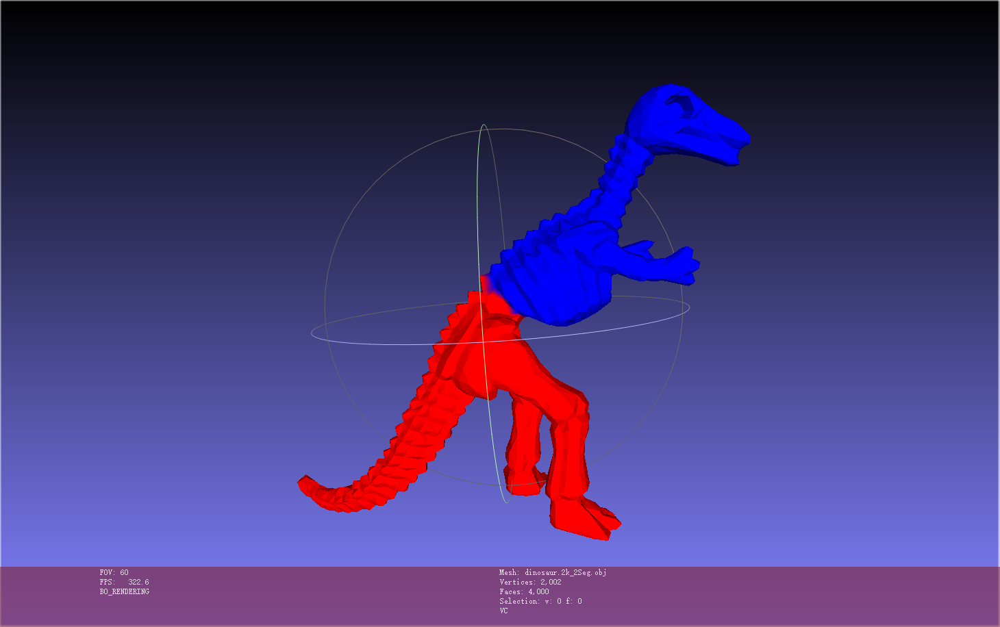

# MeshSegmentation

《Hierarchical Mesh Decomposition using Fuzzy Clustering and Cuts》的2路分解实现

+ 使用.obj格式的三维模型

+ THU某课大作业

+ 注释虽不是很详尽但足够了解功能

+ 只有2路分解

+ copy需谨慎

+ 参数需调整

+ 三个模型+分解结果供参考

### 效果展示

